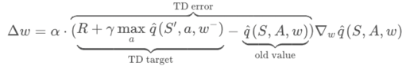
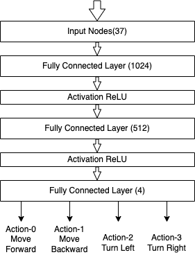
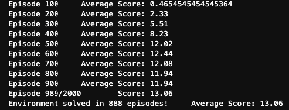
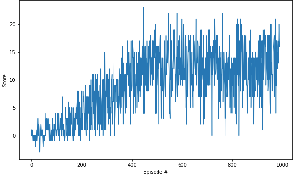

# Implementation Details

## Deep Q-Networks

This project implements a Value Based method called Deep Q-Networks.

[Research Paper](https://storage.googleapis.com/deepmind-media/dqn/DQNNaturePaper.pdf)

> Here we use recent advances in training deep neural networks to develop a novel artificial agent, termed a deep Q-network, 
that can learn successful policies directly from high-dimensional sensory inputs using end-to-end reinforcement learning. 

Deep Q-Learning combines 2 approaches:
* A Reinforcement Learning method called [Q-Learning](http://citeseerx.ist.psu.edu/viewdoc/download?doi=10.1.1.80.7501&rep=rep1&type=pdf) (aka SARSA max).
* A Deep Neural Network to learn a Q-table approximation (action-values).

Especially, Deep Q-Network proposes two efficient training techniques:

1. **Experience Replay**:
   > When the agent interacts with the environment, the sequence of experience tuples can be highly 
   > correlated. The naive Q-learning algorithm that learns from each of these experience tuples in 
   > sequential order runs the risk of getting swayed by the effects of this correlation. By instead keeping 
   > track of a **replay buffer** and using **experience replay** to sample from the buffer at random, we can 
   > prevent action values from oscillating or diverging catastrophically. 
   > 
   > The **replay buffer** contains a collection of experience tuples (S, A, R, S'). The tuples are gradually 
   > added to the buffer as we are interacting with the environment.
   > 
   > The act of sampling a small batch of tuples from the replay buffer in order to learn is known as **experience replay**.
   > In addition to breaking harmful correlation, experience replay allows us to learn more from individual tuples multiple 
   > times, recall rare occurrences, and in general make better use of our experience.
       
2. **Fixed Targets**:
   > In Q-Learning, we **update a guess with a guess**, and this can potentially lead to harmful correlations. To avoid
   > this, we can update the parameters _**w**_ in the network **_q_** to better approximate the action value corresponding to
   > state S and action A with the following update rule:
   > 
   > 
   > 
   > where **_w¯_** are the weights of a separate target network that are not changed during the learning step,
   > and **_(S, A, R, S')_** is an experience tuple.

## Algorithm:


This algorithm screenshot is taken from the [Deep Reinforcement Learning Nanodegree course](https://www.udacity.com/course/deep-reinforcement-learning-nanodegree--nd893).


## DQN Parameters and Training Details:

### Parameters:

```shell

BUFFER_SIZE = int(1e5)  # replay buffer size

class Config(BaseModel):
    unity_env_path: str
    batch_size: int = 64  # minibatch size
    gamma: float = 0.90  # discount factor
    eps: float = 1.0  # Greedy action (1 - eps)
    eps_end: float = 0.01
    eps_decay: float = 0.995
    tau: float = 1e-3  # for soft update of target parameters
    lr: float = 1e-3  # learning rate
    update_every: int = 4  # how often to update the network
    graphics: bool = True  # Weather to show unity simulator during model training
    seed: int = 42  # Random seed

```

### Neural Network:

This DQN uses following NN architecture:



### Result:
The agent achieves the average score of score +13.0 in 888th episode using above parameters and architecture:



### Plot of Rewards:

Following plot illustrates that the agent is able to receive an average reward (over 100 episodes) of at least +13 in 
888th number of episode needed to solve the environment. (In comparison, according to Udacity's solution code for the project, 
their agent was benchmarked to be able to solve the project in fewer than 1800 episodes)



## Future Work:

1. Using CNN Head:
   > As discussed in the Udacity Course, further improvement could be to train this DQN using agent to observe raw pixels
   > instead of using the environment internal state (37) dimensions. 
   > To train Convolutional Neural Network, a raw pixel image need to go for minimal preprocessing like (rescaling of an 
   > input image, converting from RGB to gray scale, ...).
   
2. [Double DQN](https://arxiv.org/abs/1509.06461):
   > The popular Q-learning algorithm is known to overestimate action values under certain conditions. 
   > It was not previously known whether, in practice, such overestimations are common, whether they harm performance, 
   > and whether they can generally be prevented. In this paper, we answer all these questions affirmatively. 
   > In particular, we first show that the recent DQN algorithm, which combines Q-learning with a deep neural network, 
   > suffers from substantial overestimations in some games in the Atari 2600 domain.
   > We then show that the idea behind the Double Q-learning algorithm, which was introduced in a tabular setting, 
   > can be generalized to work with large-scale function approximation. We propose a specific adaptation to the DQN 
   > algorithm and show that the resulting algorithm not only reduces the observed overestimations, as hypothesized, 
   > but that this also leads to much better performance on several games.

3. [Prioritized Experience Replay](https://arxiv.org/abs/1511.05952):
   > Experience replay lets online reinforcement learning agents remember and reuse experiences from the past. 
   > In prior work, experience transitions were uniformly sampled from a replay memory. However, this approach simply 
   > replays transitions at the same frequency that they were originally experienced, regardless of their significance. 
   > In this paper we develop a framework for prioritizing experience, so as to replay important transitions more 
   > frequently, and therefore learn more efficiently. We use prioritized experience replay in Deep Q-Networks (DQN), 
   > a reinforcement learning algorithm that achieved human-level performance across many Atari games. DQN with prioritized 
   > experience replay achieves a new state-of-the-art, outperforming DQN with uniform replay on 41 out of 49 games.
   
4. [Dueling DQN](https://arxiv.org/abs/1511.06581):
   > In recent years there have been many successes of using deep representations in reinforcement learning. Still, 
   > many of these applications use conventional architectures, such as convolutional networks, LSTMs, or auto-encoders. 
   > In this paper, we present a new neural network architecture for model-free reinforcement learning. Our dueling network 
   > represents two separate estimators: one for the state value function and one for the state-dependent action advantage 
   > function. The main benefit of this factoring is to generalize learning across actions without imposing any change to 
   > the underlying reinforcement learning algorithm. Our results show that this architecture leads to better policy evaluation 
   > in the presence of many similar-valued actions. Moreover, the dueling architecture enables our RL agent to outperform 
   > the state-of-the-art on the Atari 2600 domain.